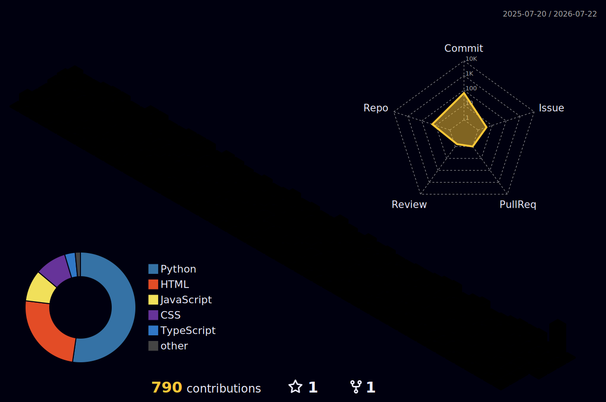

<p align="center">
  
</p>

<p align="center">
  
  &nbsp;&nbsp;
  
  &nbsp;&nbsp;
  
  &nbsp;&nbsp;
  <a href="https://rahul-agarwal.in/gitpulse" target="_blank">
    
  </a>
</p>

<p align="center">
  <a href="https://github.com/ryo-ma/github-profile-trophy">
    
  </a>
</p>

---

## ⚡ About Me

I'm **Rahul Agarwal**, a Full Stack Developer & AI/ML Specialist based in India. I specialize in building intelligent automation systems, advanced computer vision applications, and high-fidelity web experiences.

- 🎓 **Education**: BCA student focusing on AI, scalable architectures, and advanced data systems.
- 💼 **Recent Experience**: Founder's Intern & Full Stack Developer at **InferWorks** (Nov 2025 – Feb 2026).
- 🧠 **Focus Areas**: Computer Vision, Vision AI pipelines, automation workflows, and building premium full-stack products.
- 🚀 **Mission**: Bridging complex backend algorithms and AI models with stunning, intuitive user interfaces.

<br>
<p align="center">
  <a href="https://www.youtube.com/watch?v=bc0KhhjJP98" target="_blank">
    
  </a>
</p>

---

## 📟 Terminal Resume

Want to see something cool? If you have Node.js installed, pop open your terminal and run:

```bash
npx rahulagarwal18
```

You'll see an interactive, hacker-style resume card! 

---

## 🔗 Connect With Me

<p align="left">
  <a href="https://www.linkedin.com/in/rahul-agarwal-ai/" target="_blank">
    
  </a>
  &nbsp;&nbsp;
  <a href="https://rahul-agarwal.in" target="_blank">
    
  </a>
  &nbsp;&nbsp;
  <a href="mailto:rahulagaral1@gmail.com">
    
  </a>
</p>

---

## 🛠️ Tech Stack & Skills

<table>
  <tr>
    <td valign="top" width="50%">
      <h3>💻 Languages</h3>
      
      
      
      
      
      
      
      
    </td>
    <td valign="top" width="50%">
      <h3>🌐 Frameworks</h3>
      
      
      
      
      
      
    </td>
  </tr>
  <tr>
    <td valign="top" width="50%">
      <h3>🧠 Libraries & AI</h3>
      
      
      
      
      
      
    </td>
    <td valign="top" width="50%">
      <h3>⚙️ Tools & Platforms</h3>
      
      
      
      
      
      
    </td>
  </tr>
</table>

---

## 🚀 Featured Projects

Here are some of my highlighted projects that demonstrate my skills in computer vision, deep learning, full-stack development, and IoT integrations.

### 🧠 [NeuralDocs — Intelligent AI Document RAG System](https://github.com/rahulagarwal18/NeuralDocs)
* **Description**: An advanced enterprise-grade Retrieval-Augmented Generation (RAG) pipeline built using LangChain, FAISS, and Meta's Llama-3.3 LLM. Allows users to upload massive PDFs and semantically query them in real-time through a stunning glassmorphism web interface.
* **Stack**: `Python` • `Flask` • `LangChain` • `FAISS` • `Llama-3` • `Groq API` • `HuggingFace`

### 🌌 [GitPulse — Cinematic Developer Storyteller](https://rahul-agarwal.in/gitpulse)
* **Live Application**: [rahul-agarwal.in/gitpulse](https://rahul-agarwal.in/gitpulse)
* **Description**: A premium, interactive web application that transforms standard GitHub profiles and repository logs into glowing, animated contribution universes. Includes **Stellar Duel** comparison mode to duel with other developers live!
* **Stack**: `HTML5 Canvas` • `CSS (Glassmorphism)` • `GSAP (Animations)` • `JavaScript`

### 🛠️ [Live OMR Scanner System](https://github.com/rahulagarwal18/omrscanner)
* **Description**: A real-time OMR sheets scanning pipeline featuring camera integration. It automates result grading and exports clean CSV reports.
* **Stack**: `Python` • `OpenCV` • `Flask` • `SQLite`

### 🗺️ [Smart 360° Navigation](https://github.com/rahulagarwal18/yprstreetview)
* **Description**: An interactive 360° virtual campus tour utilizing directional mapping. Features hardware/robotic guide integration for physical navigation.
* **Stack**: `JavaScript` • `Panolens.js` • `IoT` • `Robotics`

### 👤 [Face Recognition Attendance](https://github.com/rahulagarwal18/Automation-Project-)
* **Description**: AI-driven biometric attendance scanner providing instant face identification, real-time logging, and administrative management.
* **Stack**: `Python` • `OpenCV` • `Flask` • `SQLite`

### 🎨 [Connect App (Event Booking App)](https://github.com/rahulagarwal18/Event-booking-app-figma)
* **Description**: A modern, sleek event discovery and booking UI designed in Figma, focusing on minimalistic visuals and optimal navigation flows.
* **Stack**: `Figma` • `UI/UX Design` • `Interactive Prototyping`

### 🏷️ [Barcode Generator Utility](https://github.com/rahulagarwal18/barcode-generator)
* **Description**: Bulk barcode generating tool built for library automation. Allows users to configure ranges and download formatted PDFs ready for printing.
* **Stack**: `Flask` • `Python` • `ReportLab`

### 🧠 [CNN Image Classifier](https://github.com/rahulagarwal18/parsing)
* **Description**: A deep convolutional neural network model trained on CIFAR-10, optimized to classify images with high testing accuracy.
* **Stack**: `TensorFlow` • `Keras` • `Python`

---

## ✍️ Latest Tech Articles

<!-- BLOG-POST-LIST:START -->
- [Passion Pilot - AI-Powered Learning Journeys](https://dev.to/rahul_agarwal18/passion-pilot-ai-powered-learning-journeys-12ll)
- [The Reality of AI and Tech Layoffs in India &lpar;And How to Survive Them&rpar;](https://dev.to/rahul_agarwal18/the-reality-of-ai-and-tech-layoffs-in-india-and-how-to-survive-them-11k0)
- [HTMX vs React: When to Actually Use Which in 2026](https://dev.to/rahul_agarwal18/htmx-vs-react-when-to-actually-use-which-in-2026-4fd7)
- [The Rise of DeepSeek and Qwen: Are Western LLMs Losing Their Moat?](https://dev.to/rahul_agarwal18/the-rise-of-deepseek-and-qwen-are-western-llms-losing-their-moat-45cl)
- [The End of useMemo: Why React 19&#39;s Compiler is a Game Changer](https://dev.to/rahul_agarwal18/the-end-of-usememo-why-react-19s-compiler-is-a-game-changer-4nd0)
<!-- BLOG-POST-LIST:END -->

---

## 📊 Weekly Coding Stats

<!--START_SECTION:waka-->


📅 **I'm Most Productive on Monday** 

```text
Monday                   137 commits         ████░░░░░░░░░░░░░░░░░░░░░   16.67 % 
Tuesday                  115 commits         ███░░░░░░░░░░░░░░░░░░░░░░   13.99 % 
Wednesday                114 commits         ███░░░░░░░░░░░░░░░░░░░░░░   13.87 % 
Thursday                 115 commits         ███░░░░░░░░░░░░░░░░░░░░░░   13.99 % 
Friday                   131 commits         ████░░░░░░░░░░░░░░░░░░░░░   15.94 % 
Saturday                 89 commits          ███░░░░░░░░░░░░░░░░░░░░░░   10.83 % 
Sunday                   121 commits         ████░░░░░░░░░░░░░░░░░░░░░   14.72 % 
```


📊 **This Week I Spent My Time On** 

```text
💬 Programming Languages: 
No Activity Tracked This Week
```


 Last Updated on 12/07/2026 14:23:10 UTC
<!--END_SECTION:waka-->

---

## 📈 Recent Activity

<!--START_SECTION:activity-->
1. ❗ Opened issue [#1](https://github.com/rahulagarwal18/github-achievements-test/issues/1) in [rahulagarwal18/github-achievements-test](https://github.com/rahulagarwal18/github-achievements-test)
2. 🔒 Closed issue [#1](https://github.com/rahulagarwal18/github-achievements-test/issues/1) in [rahulagarwal18/github-achievements-test](https://github.com/rahulagarwal18/github-achievements-test)
3. ❗ Opened issue [#3](https://github.com/rahulagarwal18/rahulagarwal18/issues/3) in [rahulagarwal18/rahulagarwal18](https://github.com/rahulagarwal18/rahulagarwal18)
<!--END_SECTION:activity-->

---

## 📈 GitHub Insights

<p align="center">
  
</p>

<table align="center" border="0" cellpadding="0" cellspacing="0">
  <tr>
    <td align="center" valign="middle">
      
    </td>
    <td align="center" valign="middle">
      
    </td>
  </tr>
  <tr>
    <td align="center" colspan="2" valign="middle">
      <br />
      
    </td>
  </tr>
</table>

---

## 🏙️ 3D Contribution City

<p align="center">
  
</p>

<p align="center">
  <i>"Code is not just instructions; it is the infrastructure of tomorrow."</i>
</p>

---

## 🎮 Play Tic-Tac-Toe with my AI!

Click on any white square `⬜` to make your move! An issue will open—just click **Submit new issue** and the AI will automatically play its turn and update this board!

<!-- TTT_BOARD_START -->
**New game started! You are ❌. Your turn!**

| | | |
|---|---|---|
| [⬜](https://github.com/rahulagarwal18/rahulagarwal18/issues/new?title=ttt%7C0&body=Just+click+Submit+new+issue+to+play+your+move!) | [⬜](https://github.com/rahulagarwal18/rahulagarwal18/issues/new?title=ttt%7C1&body=Just+click+Submit+new+issue+to+play+your+move!) | [⬜](https://github.com/rahulagarwal18/rahulagarwal18/issues/new?title=ttt%7C2&body=Just+click+Submit+new+issue+to+play+your+move!) |
| [⬜](https://github.com/rahulagarwal18/rahulagarwal18/issues/new?title=ttt%7C3&body=Just+click+Submit+new+issue+to+play+your+move!) | [⬜](https://github.com/rahulagarwal18/rahulagarwal18/issues/new?title=ttt%7C4&body=Just+click+Submit+new+issue+to+play+your+move!) | [⬜](https://github.com/rahulagarwal18/rahulagarwal18/issues/new?title=ttt%7C5&body=Just+click+Submit+new+issue+to+play+your+move!) |
| [⬜](https://github.com/rahulagarwal18/rahulagarwal18/issues/new?title=ttt%7C6&body=Just+click+Submit+new+issue+to+play+your+move!) | [⬜](https://github.com/rahulagarwal18/rahulagarwal18/issues/new?title=ttt%7C7&body=Just+click+Submit+new+issue+to+play+your+move!) | [⬜](https://github.com/rahulagarwal18/rahulagarwal18/issues/new?title=ttt%7C8&body=Just+click+Submit+new+issue+to+play+your+move!) |

<!-- TTT_BOARD_END -->
